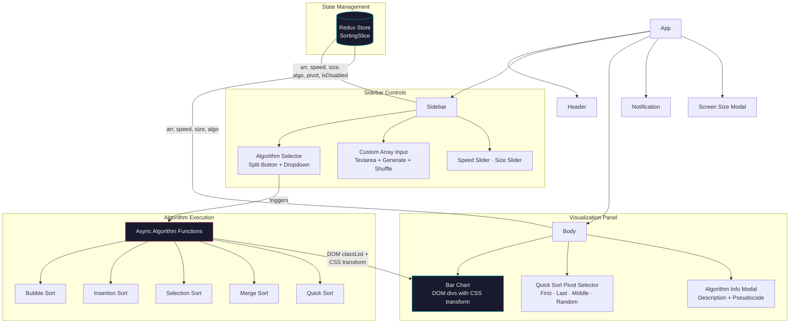

# Sorting Visualizer

An interactive web application that visualizes classic sorting algorithms step-by-step using animated bar charts. Built with React and Redux Toolkit.

<!-- Deploy your own instance and add the link here -->

<!-- Add a demo video or screenshot here -->

## Architecture



## Features

- **5 sorting algorithms** — Bubble Sort, Insertion Sort, Selection Sort, Merge Sort, Quick Sort
- **Step-by-step animation** — each comparison, swap, and placement rendered in real time via CSS transforms
- **Color-coded states** — cyan (unsorted), green (comparing), red (pivot), blue (partition range), yellow (sorted), purple (active element)
- **Speed control** — adjustable delay from 100ms to 1500ms per operation
- **Array size control** — 5 to 50 elements, dynamically regenerated
- **Custom array input** — enter comma-separated values, or shuffle the current array (Fisher-Yates)
- **Quick Sort pivot strategies** — First, Last, Middle, or Random pivot selection
- **Algorithm info modal** — descriptions and pseudocode for each algorithm with syntax highlighting
- **Dockerized** — `Dockerfile` and `docker-compose.yml` included

## Tech Stack

| Layer | Technology | Version |
|-------|-----------|---------|
| UI Framework | React | 17.0.2 |
| State Management | Redux Toolkit | 1.6.2 |
| Component Library | MUI (Material UI) | 5.2.2 |
| CSS-in-JS | Emotion | 11.7.0 |
| Async Intervals | set-interval-async | 2.0.3 |
| Syntax Highlighting | PrismJS (via Babel plugin) | — |
| Container | Docker (Node 16 Alpine) | — |

## Getting Started

### npm

```bash
npm install
npm start
```

Open [http://localhost:3000](http://localhost:3000).

### Docker

```bash
docker-compose up --build
```

## Project Structure

```
src/
├── Algorithms/
│   ├── Bubble_sort.js        # O(n²) bubble sort with swap animation
│   ├── insertion_sort.js     # O(n²) insertion sort with shift animation
│   ├── selection_sort.js     # O(n²) selection sort with min-find animation
│   ├── merge_sort.js         # O(n log n) merge sort with merge animation
│   ├── quick_sort.js         # O(n log n) quick sort, 4 pivot strategies
│   └── SetInterval.js        # Async interval wrapper tied to Redux speed state
├── Body/
│   ├── Body.js               # Bar chart rendering + algorithm info trigger
│   └── BodyParts/
│       ├── QuickSortPivot.js  # Pivot strategy selector (checkboxes)
│       ├── AboutAlgo/         # Algorithm descriptions + pseudocode per algorithm
│       └── CodeHighlight.js   # PrismJS syntax highlighting wrapper
├── SideBar/
│   ├── Sidebar.js             # Control panel layout
│   ├── Buttons/Buttons.js     # Algorithm dropdown + sort trigger + generate/stop
│   ├── Sliders/Sliders.js     # Speed and array size sliders
│   └── Input/ArrayInput.js    # Custom array textarea + generate + shuffle
├── Header/Header.js           # App title bar
├── ModalHandler/Modal.js      # Reusable MUI modal wrapper
├── Notification.js            # Snackbar notifications
├── features/
│   ├── SortingSlice.js        # Redux slice: arr, speed, size, algo, pivot, isDisabled
│   └── arrGenerate.js         # Random array generator (values 10–79)
└── app/store.js               # Redux store configuration
```

## How It Works

1. **Array generation** — random values (10–79) mapped to bar heights (`value * 4px`), positioned via CSS `transform: translate()`
2. **Algorithm execution** — async functions iterate through algorithm steps, using `set-interval-async` with configurable delay from Redux state
3. **Visual feedback** — each step directly manipulates DOM element classes (`green`, `red`, `yellow`, `blue`) and CSS transforms to animate bar positions
4. **UI lock** — `isDisabled` Redux flag disables all controls during sorting to prevent state corruption

## Algorithms

| Algorithm | Time Complexity | Space | Visualization Highlights |
|-----------|----------------|-------|--------------------------|
| Bubble Sort | O(n²) | O(1) | Green = comparing pair, Yellow = sorted |
| Insertion Sort | O(n²) | O(1) | Green = element being inserted |
| Selection Sort | O(n²) | O(1) | Red = current min, Green = comparing |
| Merge Sort | O(n log n) | O(n) | Elevation animation during merge |
| Quick Sort | O(n log n) avg | O(log n) | Blue = partition, Red = pivot, Purple = scanning |

## License

MIT
